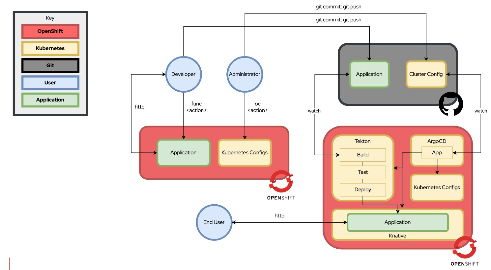

# Summary

This repo is for demo purposes only.  It can be reproduced by following the instructions below 
against a Red Hat OpenShift for AWS (ROSA) cluster.  It may work on other variations but 
has not been validated against them.  It was last tested against OpenShift 4.12.0.

## Diagram



## Prereqs

**NOTE:** the following are examples for installing utilities on Mac

1. [Bitwarden](https://bitwarden.com/) account and CLI with the following variables vaulted (used to store variables securely):

* rosa-admin-password (password field)
* rosa-gitlab-token (username/url/password fields)

```
brew install bitwarden-cli
```

2. The following utilities installed:

* `knative` tooling with `func` plugin (https://knative.dev/docs/)
* `make`
* `rosa`
* `openshift-cli`

```
brew install knative/client/kn
brew install func
brew install openshift-cli
```

## Commands

### Admin

1. Create a cluster:

```
make admin-cluster-create
```

2. Enable authentication:

```
make admin-auth-setup
```

3. Enable Serverless/Pipelines Operators:

```
make admin-operators-install
```

4. Enable Knative (serverless):

```
make admin-knative-config
```

### Developer

1. Create a project:

```
oc create project demo-app
```

2. Deploy the pipeline:

```
make code-pipeline-deploy
```

3. Run the pipeline to deploy the code:

```
make code-pipeline-run
```

4. Update the code, push the code, and witness the changes to the application:

```
watch oc get pods -n demo-app
```
